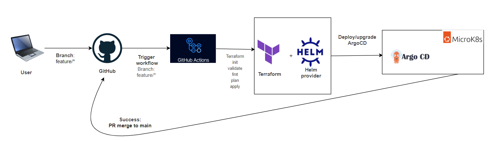

## homelab
This repo is a homelab setup based on a microk8s cluste on WSL2.

### Contineous Delivery Tool:

**ArgoCD:** ArgoCD is used as a CD tool to deploy Applications and other Cloud native tools on microk8s Cluster.

**BootStrap Argocd on Microk8s:**
- Terraform + Helm provider
- Github Actions

